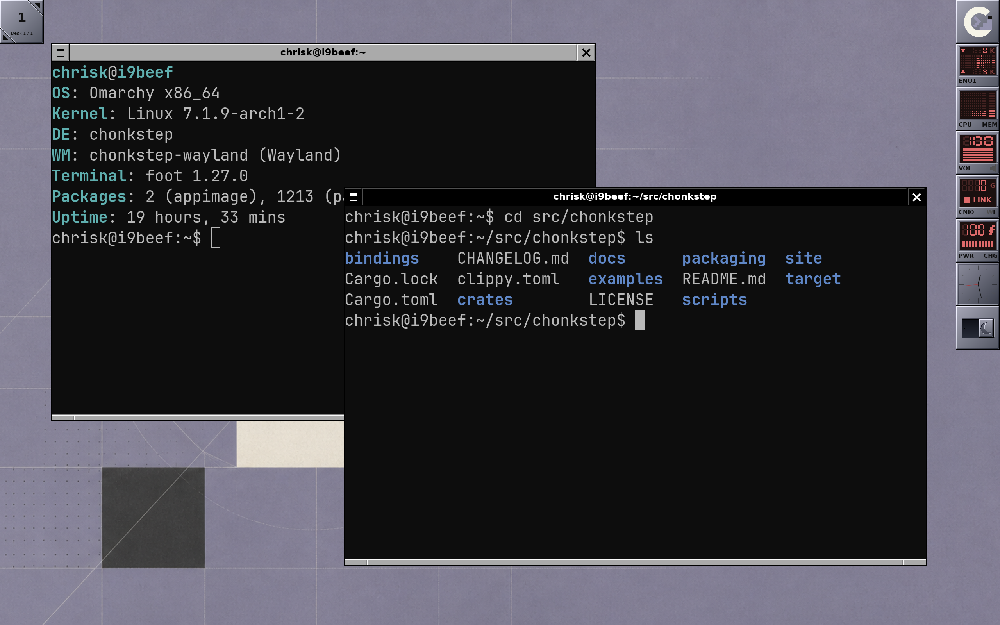
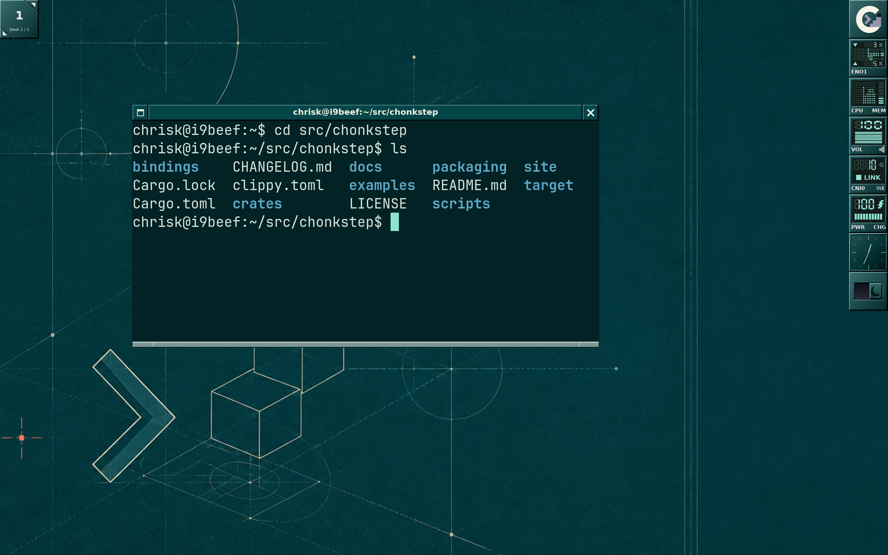
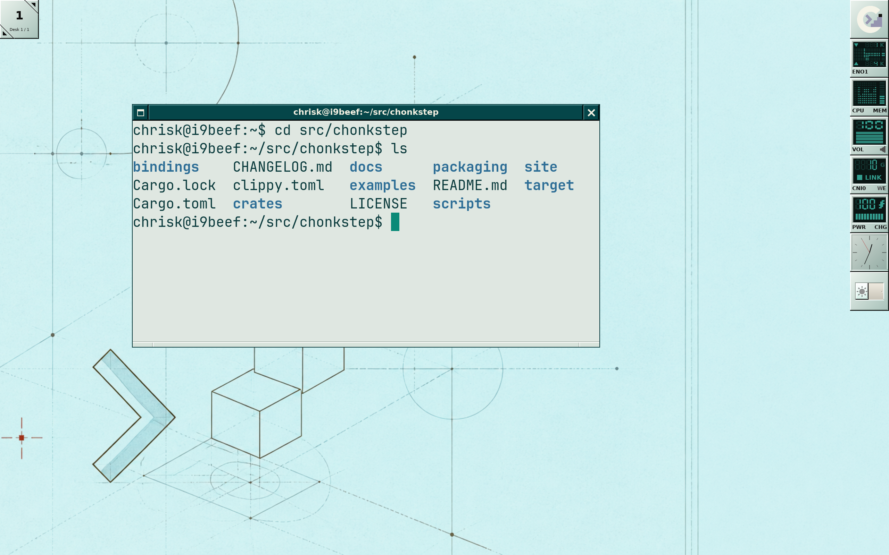
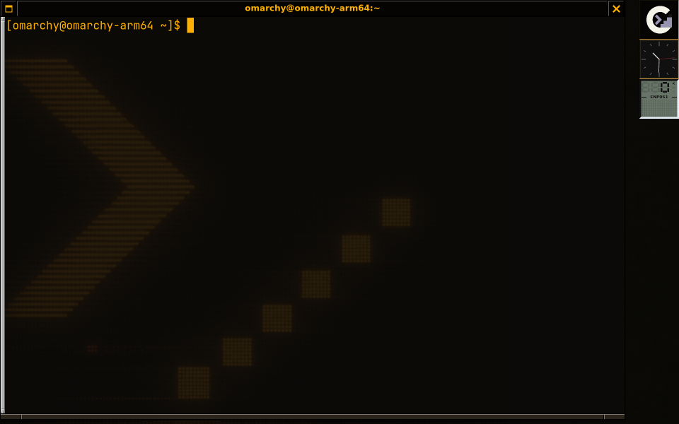

# chonkstep

A NeXTSTEP-style desktop for Linux, written in Rust: one shell behind
two real login sessions - an X11 window manager and a Wayland
compositor - so a feature lands once and both stacks get it by
construction. The chrome is chiseled and specified to the pixel, under
a dock of crash-proof out-of-process instruments, real workspaces, a
modal Overview, and eight themes - each in a hand-designed light and
dark rendition - that apply live with nothing closed.
Sessions survive: layout restore across logins and crashes, a
supervised compositor that comes back locked, and hot restarts that
keep your windows open on X11.



There is a longer illustrated tour in [site/index.html](site/index.html),
a walkthrough from install to first hour in
[docs/quickstart.md](docs/quickstart.md), and the release history in
[CHANGELOG.md](CHANGELOG.md).

## Features

- **Chiseled decorations.** Focused black/unfocused gray titlebars,
  flush full-height buttons with the stock glyphs, etched resizebar
  grips - every metric, bevel step, and glyph bitmap written down to
  the pixel rather than eyeballed from screenshots.
- **Resize everywhere.** All eight edges and corners resize, with
  macOS-style cursor affordances: diagonal arrows on corners, vertical
  and horizontal arrows on the flat sides. North and west drags anchor
  the opposite edge, and client size hints (a terminal's cell grid) are
  respected mid-drag.
- **Classic window behaviors.** New windows are placed by a
  smart-placement scan - least overlap, top-left bias - with the
  `placement` setting switching to cascade or center. A right-click on
  any titlebar opens the window commands menu:
  maximize, miniaturize, shade, fullscreen, move to another workspace,
  close, and kill for the window that ignores close. And move-drags
  snap flush against screen and window edges, with the classic edge
  resistance feel (`edge_resistance` tunes the distance; 0 turns it
  off).
- **A modal Alt-Tab switcher.** Hold Alt and Tab through a centered
  switch panel of live window thumbnails - selection commits when Alt
  is released, Escape cancels, Shift+Tab steps backward. The panel is
  drawn in the active theme's language - the same chiseled chrome as
  everything else on screen, not a generic overlay.
- **The Overview.** `super+up` (the bindable `overview` action) lays
  every window on the desk out as a card in miniature real chrome with
  a live capture, over a strip of genuine workspace tiles: arrows
  move, Return or a click focuses, right-click opens the real window
  commands menu, clicking a workspace tile switches desks, Escape
  dismisses. Captures are served at card resolution while it is open,
  so terminal text stays legible.
- **The Living Desktop.** `restore_session = true` records every
  window's application, geometry, workspace and shape as you work and
  relaunches that layout at the next login - and after a crash, which
  the Wayland session script supervises: abnormal exits restart the
  compositor with the recorded layout (a crash loop trips a brake
  instead), and with `lock_command` set the recovered session comes
  back locked. Restore never resurrects a window you closed.
- **The Instrument Platform.** Every dock tile is a separate process
  that pushes finished pixels over a private socket and gets theme,
  scale, input and supervision in return - so a widget that crashes,
  hangs or loops shows a dead face in its own tile and cannot take the
  desktop with it. A tile can also open an **instrument panel**: click
  it and a framed detail view unfolds beside the dock, streamed by the
  same process, chiseled chrome and dismissal owned by the shell - one
  panel at a time, never any keyboard focus, torn down by the same
  ping machinery as a hung tile. The wire protocol is specified
  byte-for-byte ([docs/dockapp-protocol.md](docs/dockapp-protocol.md)),
  Python and Go bindings ship dependency-free - panels included - and
  `chonk-get` installs a dockapp from a git URL or local path. See
  [docs/instrument-platform.md](docs/instrument-platform.md).
- **Theme engine with eight built-in themes.** NeXTSTEP Classic, Amber
  Phosphor, Teal Blueprint, Graphite, NeXT Lavender, Jade Lacquer,
  Ivory Halftone, and Indigo Filament. A theme restyles everything at
  once - window chrome, menus, wallpaper, dock, and the terminal's
  16-color palette - and switching from the root menu applies on the
  spot: no restart, nothing closed, every window and dockapp where you
  left it. (Terminals already open keep the palette they launched
  with; new ones get the new one.)
- **Light and dark, everywhere.** Appearance is a second axis, not a
  fork of the theme list: every theme carries two hand-designed
  renditions of itself - fills, bevel ramps, menu palette, the full
  16-color terminal scheme, and the wallpaper artwork's own mood each
  drawn per side. Light is not inverted dark: the focused titlebar
  stays ink on both sides (inverting *that* is what stops a light
  desktop from showing which window has the keyboard). Switching is
  live and scriptable - write `light`, `dark` or `toggle` to a state
  file and the whole desktop re-dresses in place, running terminals
  retinted, GTK/portal applications told to follow - and
  `examples/chonk-switch` puts the toggle in the dock as a machined
  slide switch. With nothing configured each theme wears its native
  mood (dark for seven, light for Ivory Halftone), so nothing changes
  until you ask. The file contract is public:
  [docs/appearance.md](docs/appearance.md).
- **Translucent terminals.** Each theme sets a glass opacity for the
  terminals it spawns, composited as true alpha through a session
  compositor. The window manager creates 32-bit ARGB frames so client
  alpha survives reparenting - any translucent app works, not just the
  terminal.
- **HiDPI scaling, changed live.** `scale` in the config file (or
  `CHONKSTEP_SCALE`) scales every piece of chrome - titlebars, buttons,
  bevels, cursors, glyphs - as one system, and `scripts/reload.sh`
  applies a new value to the running session: the chrome re-lays-out,
  the dock and Clip re-measure, the pointer cursors are redrawn, and
  every dockapp is told its new tile size. Applications already running
  keep the font and cursor sizes they were launched with, since those
  are read once at their own startup. On the Wayland session scale is
  also per-output and honestly fractional - fractional-scale-v1 plus
  viewporter, a `wlr-randr --scale 1.25` applies mid-session, and a
  client without the protocol renders sharp and is downscaled, never
  blurred up.
- **Live reload, and hot restart.** Two different things, and the
  first is the one you usually want. `scripts/reload.sh` (or the
  bindable `reload` action) re-reads the config file and applies all of
  it - theme, scale, focus policy, placement, edge resistance,
  terminal font size, the keybindings themselves - to the running
  session, keeping every window, client connection and dockapp.
  `scripts/restart.sh` re-execs the on-disk binary, which is how
  `scripts/update.sh` picks up a *new build*: the one change a running
  process cannot apply to itself. Open windows survive a restart on
  X11 via the SaveSet; on Wayland they do not, which is exactly why
  reload exists.
- **EWMH compliance.** Publishes `_NET_SUPPORTED`, the client list,
  active window, workspaces, and workarea, and honors activation,
  close, and fullscreen/maximize requests - so `wmctrl`, `xdotool`,
  taskbars, and pagers see real state, video players go properly
  fullscreen, and `_NET_WM_WINDOW_TYPE` picks the decoration policy
  (dialogs get chrome, docks and notifications are left alone).
  `scripts/verify-ewmh.sh` checks a live session from the outside.
- **A real application story.** The root menu's Applications submenu
  is generated from the system's freedesktop `.desktop` entries -
  categories become cascades, `Terminal=true` apps launch inside the
  themed terminal, NoDisplay/Hidden/TryExec respected - so every
  installed app is launchable on day one. And the classic NeXTSTEP
  desktop's defining feature, the launcher dock: drag a miniaturized
  window's icon tile onto the strip below the Clip to pin its
  application (resolved through the `.desktop` index), click to
  launch - or to focus the running window, marked by an accent lamp on
  the tile - drag along the strip to reorder, drag off to unpin. Pins
  persist across sessions.
- **A NeXTSTEP-style desktop shell.** Right-click root menu with
  cascading submenus, a dock of instrument apps - an analog clock plus
  five LED instruments on theme-reactive glass (network traffic with a
  mirrored up/down history matrix, CPU and memory load, sound volume
  with click-zone control, wifi/ethernet link state, battery/power) -
  miniaturized-window icon tiles with drag-to-place, and
  eight built-in wallpaper artworks, each with a rendition per
  appearance mood. Real workspaces, too: a dock
  Clip - the workspace tile, drawn on the same recipes as the rest of
  the dock - sits at the top-left corner: clipped-corner arrows advance
  (growing workspaces on demand) and rewind, Alt+Ctrl+Left/Right
  switches, Alt+Shift+Left/Right carries the focused window
  along, and pagers can drive it all via `_NET_CURRENT_DESKTOP` and
  `_NET_WM_DESKTOP`.






## Installing on Omarchy (or any Arch)

Two routes. As a package (binaries to `/usr/bin`, session scripts to
`/usr/lib/chonkstep/`, both session entries installed):

```sh
git clone https://github.com/iconidentify/chonkstep.git
cd chonkstep/packaging/arch
makepkg -si -p PKGBUILD-git   # the branch head; plain PKGBUILD pins the
                              # v0.2.0 release tag once it is published
```

Or straight from the checkout, which is what `scripts/update.sh`
(pull, rebuild, hot-restart) keeps current:

```sh
git clone https://github.com/iconidentify/chonkstep.git
cd chonkstep
scripts/install.sh
```

The installer pulls the runtime dependencies with pacman (Xorg,
rxvt-unicode, picom, wireplumber for the sound instrument, the theme
fonts, the stack the Wayland compositor builds and runs against -
libxkbcommon, EGL/mesa, Xwayland, and libdrm/libinput/libudev/libseat
for the hardware session - and a Rust toolchain if needed), builds both
release binaries, installs **two** session entries that point back into
the checkout - `/usr/share/xsessions/chonkstep.desktop` and
`/usr/share/wayland-sessions/chonkstep.desktop` - and seeds
`~/.config/chonkstep/config.toml` from the fully-commented example if
you don't have one.

Both halves are real login sessions. How you start one depends on the
machine, and on which you want:

- **With a display manager** (sddm, gdm, lightdm, ...), log out and
  pick either "chonkstep" (X11) or "chonkstep (Wayland)" from the
  session list.
- **On stock Omarchy** there is no session picker at all (it boots
  straight into Hyprland via autologin), so switch to a TTY
  (Ctrl+Alt+F3), log in, and run either `startx scripts/xsession.sh`
  or `exec scripts/wayland-session.sh` from the checkout. The Wayland
  one needs no `startx`: the compositor *is* the display server, and it
  takes the graphics device, the input devices, and the VT for itself.
- **Nested**, for development or a look before you log in:
  `./target/release/chonkstep-wayland` from a terminal inside your
  current desktop opens a window that is its screen. See
  [Wayland](#wayland) below.

Seat access needs no setup on any systemd machine, Omarchy included -
logind already hands the active session its devices. On a machine
without logind, enable `seatd` and join the `seat` group; the installer
prints this only when it finds logind missing.

Once you are in, right-click the desktop: the `Omarchy` submenu of the
root menu *is* Omarchy's own menu - the same Learn / Trigger / Style /
Setup / Install / Remove / Update / System tree Omarchy's shell offers,
read from Omarchy's own `omarchy-menu.jsonc` (and your extension file)
every time either changes, with every entry running exactly as Omarchy
runs it and every `when`/`checked`/`disabled` condition answered the way
Omarchy answers it. chonkstep keeps no list of its own, so an Omarchy
upgrade shows up in the menu on its own; the only entries left out are
the ones that would command Hyprland. `omarchy_menu = false` in the
config turns the submenu off.

chonkstep can also dress in Omarchy's theme. `theme = "omarchy"` in
the config (or the `Omarchy (...)` row in the root menu's Themes
submenu) makes the desktop read the palette `omarchy-theme-set` leaves
under `~/.local/state/omarchy/current/theme/` and wear it - chrome,
dock, menus, terminals, light or dark as the palette says - on
chonkstep's own geometry, and keep watching it, so switching themes in
Omarchy restyles this desk within a second. The other direction is
`omarchy-export-themes`, built alongside the shell, which writes the
eight built-in themes as Omarchy themes into `~/.config/omarchy/themes/`
so `omarchy-theme-set amber-phosphor` dresses the rest of the machine
to match. Details in [docs/appearance.md](docs/appearance.md).

Omarchy's bar, and anything else that wants to draw the desktop's
state, talks to the shell over a small socket at
`$XDG_RUNTIME_DIR/chonkstep/control-<display>.sock` - newline-framed
JSON, one line per fact: workspaces, outputs, the focused window, the
theme, each re-sent when it changes. It is always on, on both sessions;
every process the shell launches finds the path in
`CHONKSTEP_CONTROL_SOCKET`. The protocol is written down in full in
[`docs/control-socket.md`](docs/control-socket.md), and
`socat - UNIX-CONNECT:$CHONKSTEP_CONTROL_SOCKET` is enough to watch it.
Its first clients are two Omarchy bar widgets under
[`omarchy/plugins/`](omarchy/README.md) - `chonkstep.workspaces`, the
workspace strip Omarchy's own widget cannot draw here because it asks
Hyprland, and `chonkstep.theme`, the active theme's name - which
install like any other Omarchy plugin and import nothing from Hyprland.

The bar and the Dock share a corner, and the Dock gives way. Omarchy's
bar is a layer-shell surface that reserves the top strip of the
screen, and its power button lives at the far right of that strip -
exactly where the Dock's identity tile hangs. Layer-shell gives a bar
no way to ask a compositor's own chrome to move, so the compositor
moves it: while a bar holds the top (or right) edge, the Dock hangs
itself under (or beside) it, and maximized windows fill what is left
between the two - windows already maximized when the bar arrives are
refitted, and everything returns to the corner the moment the bar
exits. Omarchy's shell needs to know nothing about any of this; it
draws its bar the way it draws it on Hyprland.

Omarchy's terminals get titlebars, though they never ask for them.
Omarchy configures alacritty and kitty to draw no decorations - right
under Hyprland, which has none - and under a desktop that does, each
one negotiates client-side chrome and then draws nothing. chonkstep
believes every other client about its own chrome, but ships those two
(under every class Omarchy launches them as, including the
`org.omarchy.terminal` behind `omarchy-update`) in `[decorations]
server_side`, so the update window, the installers and a plain terminal
all wear this desktop's frame; `server_side = []` in the config takes it
back off.

On a HiDPI display, set `scale = 2.0` in
`~/.config/chonkstep/config.toml` - it scales chrome, dock, cursors,
and the terminal font as one system.

Nothing is copied out of the repository, so updating is:

```sh
scripts/update.sh
```

which pulls, rebuilds, and hot-restarts the running session in place.

## Wayland

chonkstep is one desktop with two faces. Everything the desktop *is*
lives in backend-generic crates - `wm-core` decides (placement, focus,
stacking, workspaces, the modal Alt-Tab machinery), `wm-theme` renders
the decorations, and `chonk-shell` is the whole desktop above them:
dock, instruments, Clip, launcher strip, menus, wallpaper, themes. Two
backends implement the one backend contract those crates are written
against - `wm-x11`, and `wm-wayland`, a compositor built on
[Smithay](https://github.com/Smithay/smithay) - and two thin binaries,
`chonkstep` and `chonkstep-wayland`, wire the same shell to each. That
is what keeps the two sessions identical: a feature or a fix lands
once, in the shared crates, and both stacks get it by construction
rather than by porting discipline.

The Wayland side is the younger half, and it runs in two shapes from
one binary. Which one it takes is decided at startup, not at build
time: if there is already a desktop here to nest inside (an existing
`WAYLAND_DISPLAY` or `DISPLAY`) it opens a window; if there is not - a
bare TTY, a display manager's Wayland session - it takes the hardware.
`CHONKSTEP_BACKEND=winit` or `=session` forces the choice.

**As a login session**, the compositor owns the machine the way Xorg
does for the X11 side: it opens the seat through libseat (logind, or
seatd where there is no logind), sets a mode on the DRM device, drives
page flips through GBM and EGL, and reads real keyboards, mice, and
touchpads through libinput and udev. Ctrl+Alt+F1..F12 switches VTs and
the session hands its devices back and comes alive again on the way
in, so the console is never more than a keystroke away. Pick
"chonkstep (Wayland)" in your display manager's session list, or from a
TTY:

```sh
exec scripts/wayland-session.sh
```

That script is the Wayland twin of `scripts/xsession.sh` - it is what
the `wayland-sessions` entry points at, and it is also where you set
your keyboard layout for a TTY login (`XKB_DEFAULT_LAYOUT` and
friends; there is no settings daemon on a bare VT to ask). It starts no
compositing manager, unlike the X11 script: the compositor composites
itself, so the themes' translucent terminals are true alpha in the same
GLES scene that draws the chrome.

What the session backend does not do yet, stated plainly:

- **One GPU, every connector on it.** The session drives every display
  plugged into the primary DRM device, each with its own mode, page
  flips, and place in the desktop layout; a second GPU's outputs stay
  dark. Nothing hot-plugs: a monitor or GPU that appears mid-session is
  logged and ignored, so docking a laptop means restarting the session.
  Arrangement is configurable now, not compiled in: the compositor
  speaks wlr-output-management, so `wlr-randr` and `kanshi` list and
  configure outputs - position, mode, and per-output scale (fractional
  included), applied live. What the backend cannot honor - disabling
  an output, transforms - is refused with a named log line rather than
  accepted and botched. Stated honestly: the multi-output plumbing has
  been driven end to end on the nested backend and over the protocol,
  but a many-monitor DRM session has not yet been proven on physical
  hardware.
- **The hardware cursor depends on your driver.** The pointer is asked
  for the display controller's cursor plane, which is what makes it
  track the hand instead of the frame rate. Whether it gets one is the
  driver's answer: on the virtio-gpu VM this was developed against, the
  cursor plane exists and `modetest` sees it, but it never reaches the
  compositor - the universal-planes capability that exposes it is
  enabled on the device fd and the plane still does not appear by the
  time the surface is built, which looks like an interaction between
  Smithay's device bookkeeping and the fresh fd libseat hands over on
  session activation. The session logs the planes it found
  ("DRM planes available to this crtc"), so the answer for a given
  machine is one line in the log; where the plane is missing the
  pointer is composited into the frame and everything else is
  unaffected.
- **Restart costs you your clients** - though far less often than it
  used to, since a theme, a scale or any config change now applies
  without one (see **Live reload** above). The compositor does re-exec
  in place - that is how `scripts/restart.sh` and `scripts/update.sh`
  apply a new build on both backends - but Wayland clients die with the socket
  they were connected to, and there is no SaveSet equivalent to adopt
  them afterwards. The X11 session keeps your windows across a
  restart; this one keeps only itself - and its dockapps. A dockapp is
  not a display-server client (it holds no `wl_display` at all, which is
  the whole point of that boundary), so the compositor leaves it running
  across the re-exec and hands its connection token to the replacement,
  which readopts it into the same tile instead of launching a second
  copy. The result is the odd one out on this list: an out-of-process
  dock tile gets a guarantee across a restart that no ordinary Wayland
  client on this desktop can have.
- **The ecosystem protocols it speaks, and the ones it does not yet.**
  Present: wlr-layer-shell (launchers, bars, notification daemons),
  ext-session-lock (lockers - and while locked, the scene is lock
  surfaces over black and nothing else, on screen and in every capture
  path), idle-notify with idle-inhibit, wlr-screencopy (`grim` and
  friends - the site's screenshots are captured through it),
  wlr-foreign-toplevel-management, wlr-output-management (`wlr-randr`,
  `kanshi`), data-control on both its interfaces - the wlr one and the
  standardised `ext-data-control-v1` - so clipboard managers work
  (`wl-paste --watch`, `cliphist`, `clipman`, `wl-clip-persist`), on
  the middle-click selection as well as the ordinary clipboard,
  fractional-scale-v1 with viewporter, and explicit GPU
  sync (`wp_linux_drm_syncobj_v1`) on DRM sessions whose device
  supports it. Screen sharing works through the standard portal chain
  (xdg-desktop-portal-wlr over screencopy into PipeWire), verified end
  to end - [docs/screen-sharing.md](docs/screen-sharing.md) is the
  map, including the one upstream limitation: the wlr portal backend
  captures whole outputs only, so "share entire screen" works and
  "share a single window" is not offered. EWMH is published to the
  XWayland root - client list, active window, desktops, workarea,
  frame extents - and the command half works too: a pager's
  `_NET_ACTIVE_WINDOW` and `_NET_CURRENT_DESKTOP` messages drive the
  desktop (`wmctrl -l` lists, `wmctrl -a` activates, `wmctrl -s`
  switches desks). Still absent: DRM leasing, and text-input/IME - a
  CJK input method cannot compose into native Wayland clients on this
  desktop yet. X11-to-Wayland drag-and-drop does not cross the
  boundary in either direction (each world drags within itself). The
  desktop's own dock, Clip, and menus need none of it: they are drawn
  by the compositor, not by clients.

**Nested** remains the way to develop the compositor, and the way to
look at it without logging out: it opens a regular window on your
existing desktop (Wayland or X11, via Smithay's winit backend) and
that window is its screen - chrome, dock, root menu, themes, and all.
The two modes render through the same scene-building code and the same
GLES renderer, which is why what you see nested is what you get on the
hardware. From a terminal on any desktop:

```sh
cargo build --release -p chonkstep-wayland
./target/release/chonkstep-wayland
```

Either way, the compositor allocates its own Wayland socket and sets
`WAYLAND_DISPLAY` (and `DISPLAY`, through XWayland) for everything it
spawns, so applications launched from the root menu or the themed
terminal land inside the session automatically. To aim a client at a
nested one from an outside terminal instead, point these variables at
the socket names from the startup log - the Wayland socket is
typically the first free slot (`wayland-1` when your host desktop
holds `wayland-0`), and XWayland's display number is printed alongside
it:

```sh
WAYLAND_DISPLAY=wayland-1 some-wayland-app
DISPLAY=:1 urxvt
```

X11 applications are first-class citizens, not a compatibility
afterthought: the compositor starts XWayland at boot and manages its
windows through exactly the same decoration and policy machinery as
native Wayland clients, so urxvt - and everything else that predates
Wayland - runs unchanged.

## Configuration

chonkstep reads `~/.config/chonkstep/config.toml` (or
`$XDG_CONFIG_HOME/chonkstep/config.toml`) at startup. The file is
optional - with no file, the defaults below apply - and a broken file
never prevents the session from starting: invalid lines are warned
about and skipped, and a completely unreadable file just means the
defaults. See [docs/config.example.toml](docs/config.example.toml) for
a fully commented example of every option.

Nine settings and a keybinding table are available:
`focus_follows_mouse` (click-to-focus by default), `scale` (HiDPI UI
scaling; the `CHONKSTEP_SCALE` environment variable overrides it),
`theme` (a theme picked live from the root menu is persisted and wins
over it), `appearance` (`"light"` or `"dark"` - the axis every theme
has two renditions along; the running session's own persisted mode
wins after the first start, and the live way to switch is the request
file in [docs/appearance.md](docs/appearance.md)), `placement` (where
new windows land: `smart` by default, or `cascade` / `center`),
`edge_resistance` (how close, in pixels, a dragged window gets to a
screen or window edge before snapping flush; `0` disables snapping),
`terminal_font_px` (the terminal's type size at 1x scale, with the
launch geometry derived from the monitor), `restore_session` and
`lock_command` (the Living Desktop pair above). Keybindings merge
over the defaults - list a combo to change it, set it to `"none"` to
unbind it, and every unlisted default stays.

Edits apply to the running session: `scripts/reload.sh` re-reads this
file and applies all of it in place - nothing closed, no window lost -
or bind the `reload` action to a key and never leave the keyboard.
`scripts/restart.sh` is the other gesture, for after a rebuild: it
re-execs the binary to pick up a new build.

The default bindings:

| Binding          | Action                                       |
|------------------|----------------------------------------------|
| alt+shift+return | Spawn a terminal                             |
| alt+shift+q      | Close the focused window                     |
| alt+shift+x      | Toggle maximize                              |
| alt+shift+s      | Toggle shade (roll up into the titlebar)     |
| alt+shift+m      | Miniaturize to an icon tile                  |
| alt+shift+f      | Toggle fullscreen                            |
| alt+ctrl+right   | Next workspace (grows on demand)             |
| alt+ctrl+left    | Previous workspace                           |
| alt+shift+right  | Carry the focused window to the next         |
| alt+shift+left   | Carry the focused window to the previous     |
| super+up         | The modal Overview                           |

Alt+Tab window cycling is part of the modal switcher machinery and is
always available; it is not rebindable from the config file.

## Development

- `scripts/dev-nested.sh [width] [height] [scale]` runs chonkstep
  nested inside a Xephyr window on your existing desktop (Wayland or
  X11) - the standard way to develop a window manager without a second
  machine. Requires `xorg-server-xephyr`.
- `scripts/dev-vm.sh [sync|build|restart|shot|loop]` is the loop used
  to develop chonkstep from a Mac against an Omarchy ARM64 VM (managed
  by [Lume](https://github.com/trycua/cua)): rsync the tree in, build
  natively in the VM, hot-restart the live session, and pull a
  screenshot back out.
- `cargo test --workspace` runs the test suite; the decoration renderer
  is pure Rust (tiny-skia + cosmic-text, no X server needed), so most
  of the visual pipeline is unit-testable, including pixel-level
  regression tests for the relief recipes.

The workspace splits along seams that keep the core testable: `wm-core`
(window management logic, no display server), `wm-theme` (decoration
rendering), `wm-theme-api` (the boundary between them), `chonk-shell`
(the entire desktop - dock, instruments, Clip, launcher, menus,
wallpaper - generic over the backend), `wm-x11` and `wm-wayland` (the
two backends implementing that contract), `chonkstep` and
`chonkstep-wayland` (the thin binaries wiring the shell to each), and
`chonk-ui`/`chonk-about` (a small SDK surface proving third-party apps
can draw with the same visual language). Within `wm-theme`, the `tile` module is the common UI
platform for everything square: the workspace Clip's look formalized - a
diagonal gradient face under the stock raised relief, luminance-picked
ink, and sunken instrument-panel wells. Dock items,
miniaturized-window icon tiles, and third-party `chonk-ui` apps
all build on that one tile, which is why the whole desktop reads as a
single family. One level up, the `panel` module is the instrument SDK:
a theme-reactive LED screen (glass recessed behind a gasket, with an
accent-derived palette, seven-segment digits, meters, and history
matrices) that all five dock instruments draw on - and every instrument
ships a preview example (`cargo run -p wm-theme --example
preview_nettraffic -- <dir>`, likewise `_sysload`, `_soundctl`,
`_wifi`, `_power`) that renders every theme, scale, and state to PNG,
which doubles as the visual-regression harness new instruments should
copy.


## License

GPL-3.0-only for the desktop — see [LICENSE](LICENSE).

The dockapp SDKs (`bindings/`) and the example instruments
(`examples/`) are MIT — see [bindings/LICENSE](bindings/LICENSE) —
so an instrument you build on them can carry any license you like.
The socket protocol itself is just a document; nothing about
implementing it obliges you to either license.
