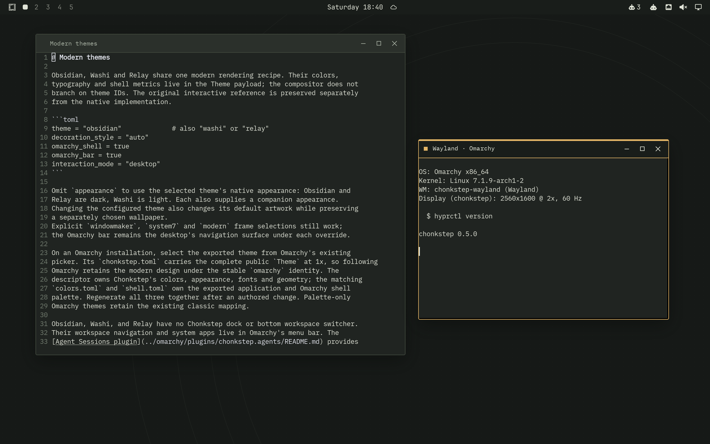
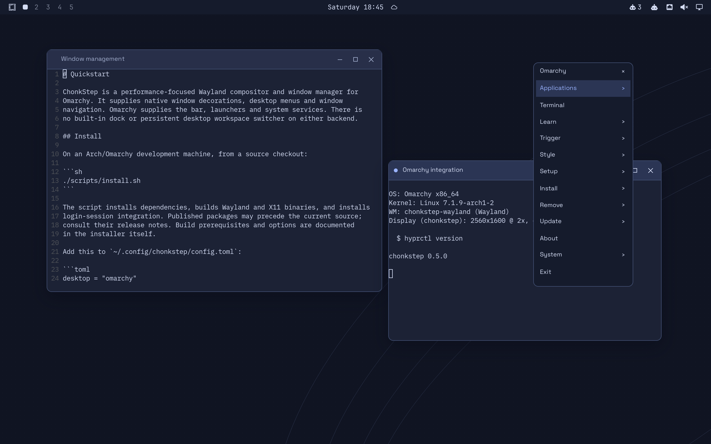
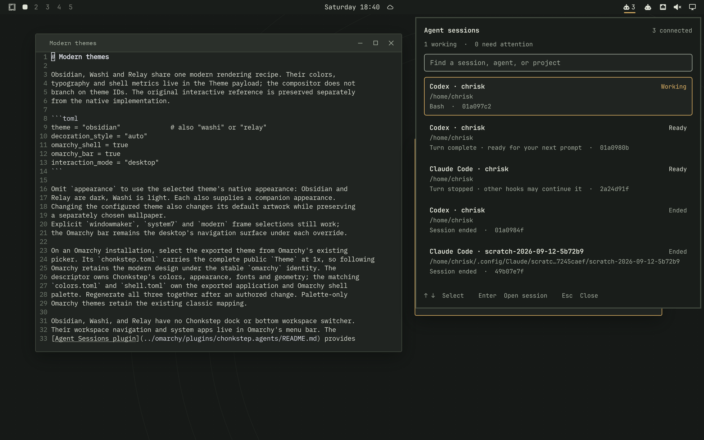
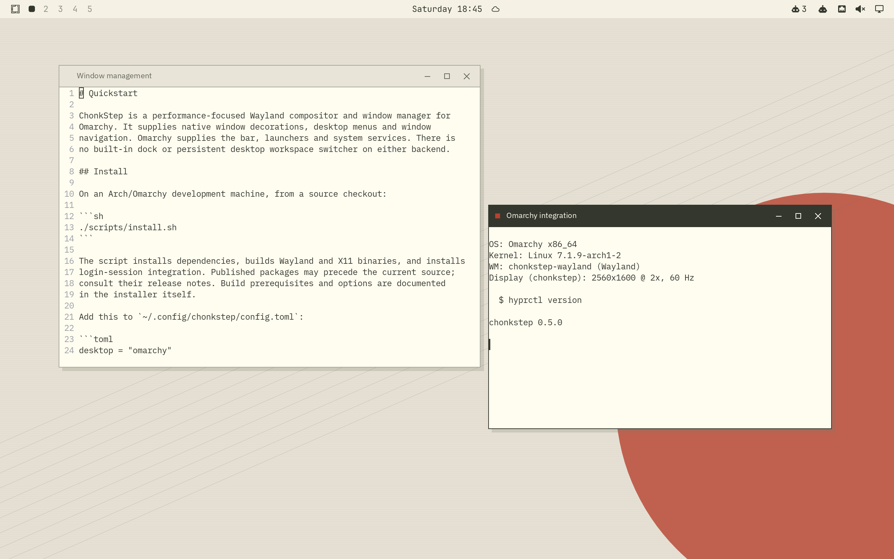
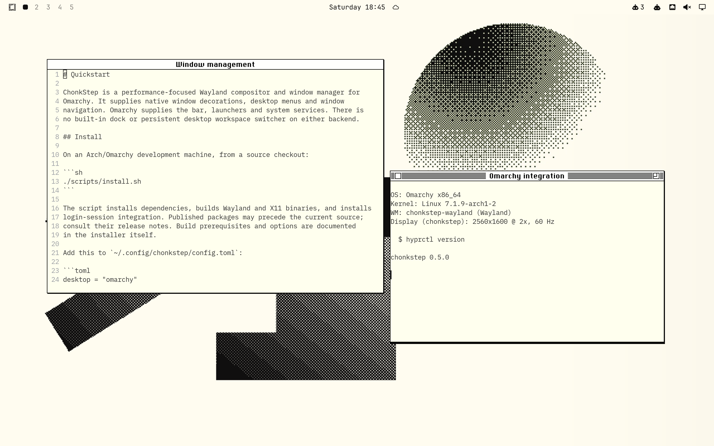
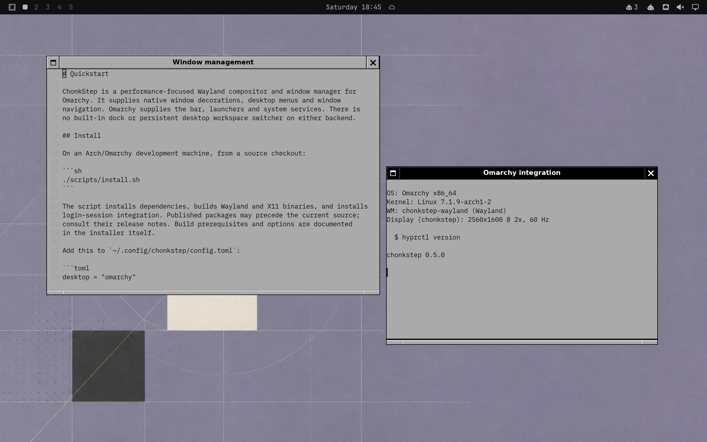

# ChonkStep

**A performance-focused Wayland compositor and window manager, built as a Hyprland drop-in for Omarchy.**

Keep Omarchy's menu bar, applications, themes, keybindings and desktop services.
ChonkStep provides the window management underneath: responsive floating
windows, optional layouts, native decorations and a desktop menu that follows
Omarchy. Written in Rust, with an emphasis on bounded work, efficient rendering
and low idle overhead.



*Obsidian. A live Wayland session running ChonkStep, Omarchy and native applications.*

## Omarchy first

ChonkStep implements the Hyprland request and event sockets used by Omarchy,
translates supported `hyprctl` operations, and follows supported settings in
`~/.config/hypr/`. Omarchy continues to own the bar, workspace indicators,
launchers, system panels, notifications, lock screen and theme picker.

Right-click the desktop for ChonkStep's native menu, populated from Omarchy's
menu tree. Right-click a titlebar for window commands. Change themes through
Omarchy and the window decorations, menus, wallpaper and application palette
follow in place.



“Drop-in” describes the integration target, not complete Hyprland feature
parity. This is **alpha software**. Supported commands and remaining gaps are
listed in the [IPC compatibility reference](docs/hyprland-ipc.md),
[Hyprland configuration guide](docs/hyprland-config.md) and
[Omarchy integration guide](docs/omarchy-integration.md). Hyprland can remain
installed alongside ChonkStep.

## Agent sessions in the menu bar

The **Agent Sessions** Omarchy plugin brings connected Codex, Claude Code,
OpenCode and configured T3 sessions into one searchable panel. See which
sessions are working, waiting or idle, then jump to a verified terminal or
session destination.



Session adapters, lifecycle tracking and navigation run in a separate local
service. The compositor does not host a model or poll provider APIs. The plugin
uses the real Omarchy shell and follows its theme. See
[setup and supported integrations](examples/chonk-agents/README.md) and the
[plugin guide](omarchy/plugins/chonkstep.agents/README.md).

## Themes for a modern desktop

**Obsidian**, **Washi** and **Relay** share a native decoration engine, with
distinct colors, typography and artwork. Each has light and dark renditions.
The same theme data drives window frames, desktop menus and window navigation;
exported Omarchy themes coordinate the rest of the desktop.



*Washi. The light theme, with the same window-management behavior and Omarchy services.*

Themes change appearance, not architecture. **There is no built-in dock,
launcher strip or persistent desktop workspace switcher in any theme**, on
Wayland or X11. Omarchy provides that desktop UI externally. The NeXTSTEP dock is available on both as the separate [Chonk Dock application](dock/README.md),
with its original instruments, panels, launchers and dockapp SDKs. Its host,
samplers and rendering run in their own process. Omarchy mode does not start it;
when it is stopped, it uses no runtime resources.

[BeOS R5](docs/beos-theme.md) adds short yellow tabs, Tracker-style menus and the original blue desktop.

The [theme guide](docs/modern-themes.md) covers selection, appearance overrides
and export. [System 7 themes](docs/system7-themes.md) provide three period desktop
patterns with their native window chrome through the same picker.
[Decoration styles](docs/decoration-styles.md) can also be selected independently
of the palette.

## Performance is a design constraint

- **Damage-driven rendering.** Redraw changed regions and reuse decoration,
  text and GPU resources when the scene is unchanged.
- **Native window previews.** Wayland Overview transforms existing client
  textures; it does not continually read the desktop back into CPU screenshots.
- **A lean shell.** No persistent dock surfaces, tile buffers, instrument
  sampling threads or dock sockets. Minimizing a window no longer captures an
  image for a desktop icon.
- **Bounded work.** Input, IPC, capture queues and caches have explicit limits.
  Slow external services run outside the compositor's render loop.
- **GPU-aware presentation.** Direct scanout and hardware cursor paths are
  used when the output, hardware and scene permit them.

We measure idle CPU, retained memory, input workloads, rendering and capture
behavior. Results include hardware, output geometry, build profile and raw
evidence; an isolated software-rendered test is not a native GPU benchmark.
See [performance measurements](docs/performance.md),
[memory behavior](docs/memory.md) and the [GPU pipeline](docs/gpu-pipeline.md).
Removing the dock eliminates its allocations and background work; the total
session footprint still depends on applications, output resolution and effects.

## Window management

- Floating windows with minimize, maximize, shade, fullscreen, snapping,
  eight-edge resizing and per-window rules.
- Freeform, Mosaic and Flow layouts, with restoration of the original floating
  arrangement when returning to Freeform.
- Alt-Tab with commit on modifier release and Escape to cancel. Minimized
  windows remain selectable and restore when chosen.
- On-demand Overview with live windows, workspace navigation and window moves.
- Optional session restore, monitor-aware placement and Mac-style keyboard
  interaction.

The persistent workspace indicator belongs to Omarchy's bar. Workspaces,
keyboard navigation and the modal Overview remain window-manager features.
See [keybindings](docs/keybindings.md), [gestures](docs/gestures.md),
[Mac interaction](docs/mac-mode.md) and [display spaces](docs/mac-display-spaces.md).

## Install and try it

The current release is **0.7.0**. Check the
[release notes](https://github.com/iconidentify/chonkstep/releases) for the
version being installed.

On an Arch/Omarchy development machine:

```sh
git clone https://github.com/iconidentify/chonkstep.git
cd chonkstep
./scripts/install.sh
```

The installer installs dependencies, builds the binaries and installs session
integration. Read [the quickstart](docs/quickstart.md) and
[Omarchy setup](docs/omarchy-mode.md) before choosing the session at login.
An Omarchy configuration starts with:

```toml
# ~/.config/chonkstep/config.toml
desktop = "omarchy"
```

For an isolated modern-theme preview from a running Wayland desktop:

```sh
cargo build --release -p chonkstep-wayland -p chonk-shell --bins
./scripts/preview-modern.sh obsidian
```

A theme or configuration reload applies in place. Installing a new compositor
binary takes effect at the next login; restarting a Wayland compositor closes
its client connections.

## Retro appearance, modern window management

System 7 and NeXTSTEP remain optional decoration styles. They are visual
choices within the same windowing system; recreating an entire historical
desktop is no longer the project's direction.

| System 7 | NeXTSTEP |
| --- | --- |
|  |  |

Wayland and Omarchy are the primary development focus. The X11 backend shares
the window-management core and desktop menus, and also has no built-in dock.
It remains available as a secondary backend.

## Development

The backend-independent `wm-core` handles window policy; `wm-wayland` and
`wm-x11` implement display-server behavior. `chonk-shell` supplies menus,
transient navigation and Omarchy integration. `wm-theme` owns themed rendering,
and `chonk-hyprland-ipc` implements the compatibility interface. Desktop plugins, [Chonk Dock](dock/README.md),
and agent adapters run outside these compositor components.

```sh
scripts/check.sh all
scripts/e2e.sh --headless --release
```

The end-to-end suite boots isolated compositors, launches real clients and
checks input, geometry and screenshots. See [performance](docs/performance.md)
for the measurement harness and [the changelog](CHANGELOG.md) for earlier releases.

## License

GPL-3.0-only. Bundled fonts and artwork retain their individual licenses.
