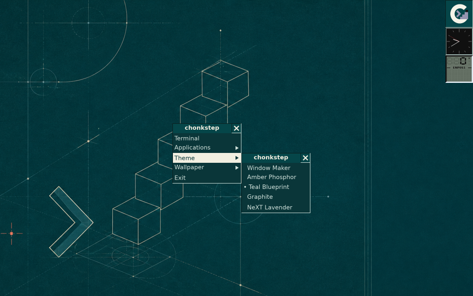
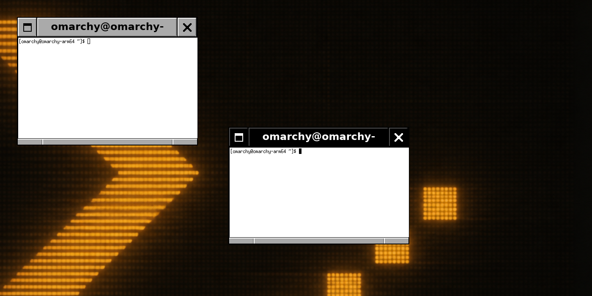

# chonkstep

A window manager for X11, written in Rust, that takes WindowMaker's
stock look seriously: the default chrome is reproduced value-for-value
from the WindowMaker source (titlebar metrics, the RAISED2 relief
recipe, the 10x10 button glyph bitmaps, the 8px resizebar with 28px
corner grips), then extended with the conveniences a modern desktop
expects - resize from every edge and corner with macOS-style cursors, a
theme engine, translucent terminals, HiDPI scaling, and in-place hot
restarts that keep your windows open.



## Features

- **WindowMaker-parity decorations.** Focused black/unfocused gray
  titlebars, flush full-height buttons with the stock glyphs, etched
  resizebar grips - checked against WindowMaker's own `framewin.c`,
  `wrlib`, and `def_pixmaps.h` rather than eyeballed from screenshots.
- **Resize everywhere.** All eight edges and corners resize, with
  macOS-style cursor affordances: diagonal arrows on corners, vertical
  and horizontal arrows on the flat sides. North and west drags anchor
  the opposite edge, and client size hints (a terminal's cell grid) are
  respected mid-drag.
- **A modal Alt-Tab switcher.** Hold Alt and Tab through a centered
  switch panel of live window thumbnails - selection commits when Alt
  is released, Escape cancels, Shift+Tab steps backward. The panel is
  drawn in the active theme's language, WindowMaker switchpanel style.
- **Theme engine with five built-in themes.** Window Maker, Amber
  Phosphor, Teal Blueprint, Graphite, and NeXT Lavender. A theme
  restyles everything at once - window chrome, menus, wallpaper, dock,
  and the terminal's 16-color palette - and switching from the root
  menu applies instantly via hot restart, windows intact.
- **Translucent terminals.** Each theme sets a glass opacity for the
  terminals it spawns, composited as true alpha through a session
  compositor. The window manager creates 32-bit ARGB frames so client
  alpha survives reparenting - any translucent app works, not just the
  terminal.
- **HiDPI scaling.** `CHONKSTEP_SCALE` scales every piece of chrome -
  titlebars, buttons, bevels, cursors, glyphs - as one system.
- **Hot restart.** `scripts/restart.sh` asks a live session to re-exec
  the freshly built binary in place; open windows survive via the X11
  SaveSet. This is also how theme switching and `scripts/update.sh`
  apply changes without logging out.
- **EWMH compliance.** Publishes `_NET_SUPPORTED`, the client list,
  active window, workspaces, and workarea, and honors activation,
  close, and fullscreen/maximize requests - so `wmctrl`, `xdotool`,
  taskbars, and pagers see real state, video players go properly
  fullscreen, and `_NET_WM_WINDOW_TYPE` picks the decoration policy
  (dialogs get chrome, docks and notifications are left alone).
  `scripts/verify-ewmh.sh` checks a live session from the outside.
- **A WindowMaker-style desktop shell.** Right-click root menu with
  cascading submenus, a dock with live widgets (clock, system monitor,
  network load), miniaturized-window icon tiles with drag-to-place, and
  five built-in wallpaper artworks. Real workspaces, too: a dock
  Clip - WindowMaker's workspace tile, ported from its dock.c
  recipes - sits at the top-left corner: clipped-corner arrows advance
  (growing workspaces on demand) and rewind, Alt+Ctrl+Left/Right
  switches, Alt+Shift+Left/Right carries the focused window
  along, and pagers can drive it all via `_NET_CURRENT_DESKTOP` and
  `_NET_WM_DESKTOP`.


## Installing on Omarchy (or any Arch)

```sh
git clone https://github.com/iconidentify/chonkstep.git
cd chonkstep
scripts/install.sh
```

The installer pulls the runtime dependencies with pacman (Xorg,
rxvt-unicode, picom, the theme fonts, and a Rust toolchain if needed),
builds the release binaries, and installs a `chonkstep.desktop` session
entry that points back into the checkout. Log out and pick "chonkstep"
in the login manager's session list; on a setup without a session
picker, `startx scripts/xsession.sh` from a TTY does the same.

Nothing is copied out of the repository, so updating is:

```sh
scripts/update.sh
```

which pulls, rebuilds, and hot-restarts the running session in place.

## Development

- `scripts/dev-nested.sh [width] [height] [scale]` runs chonkstep
  nested inside a Xephyr window on your existing desktop (Wayland or
  X11) - the standard way to develop a window manager without a second
  machine. Requires `xorg-server-xephyr`.
- `scripts/dev-vm.sh [sync|build|restart|shot|loop]` is the loop used
  to develop chonkstep from a Mac against an Omarchy ARM64 VM (managed
  by [Lume](https://github.com/trycua/cua)): rsync the tree in, build
  natively in the VM, hot-restart the live session, and pull a
  screenshot back out.
- `cargo test --workspace` runs the test suite; the decoration renderer
  is pure Rust (tiny-skia + cosmic-text, no X server needed), so most
  of the visual pipeline is unit-testable, including pixel-level
  regression tests for the WindowMaker relief recipes.

The workspace splits along seams that keep the core testable: `wm-core`
(window management logic, no X11), `wm-x11` (the backend), `wm-theme`
(decoration rendering), `wm-theme-api` (the boundary between them),
`chonkstep` (the binary and desktop shell), and `chonk-ui`/`chonk-about`
(a small SDK surface proving third-party apps can draw with the same
visual language). Within `wm-theme`, the `tile` module is the common UI
platform for everything square: the workspace Clip's look formalized - a
diagonal WindowMaker `IconBack`-gradient face under the stock RAISED2
relief, luminance-picked ink, and sunken instrument-panel wells. Dock
items, miniaturized-window icon tiles, and third-party `chonk-ui` apps
all build on that one tile, which is why the whole desktop reads as a
single family.



## License

GPL-3.0-only. See [LICENSE](LICENSE).
