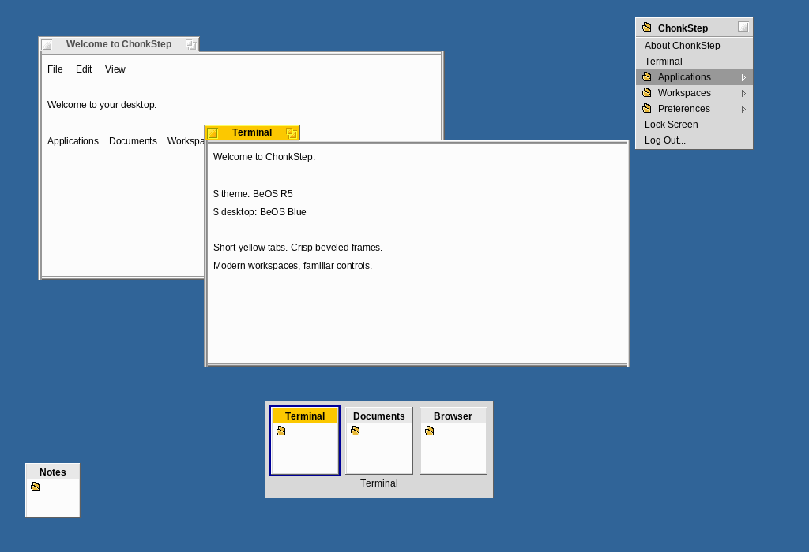

# BeOS R5



[Reviewed previews and live compositor screenshots](decoration-styles/beos/preview/README.md)
include 1×, 2× and fractional-scale renditions.

Choose **BeOS R5** in Omarchy's Theme picker. Keep `decoration_style = "auto"`
to select the complete recipe: short yellow window tabs, beveled gray frames,
Tracker-style desktop and window menus, switcher, Overview, minimized previews,
application palette, and the original blue desktop. Session startup registers
the theme, background, descriptor, and picker preview automatically.

For a directly configured ChonkStep session:

```toml
theme = "beos"
decoration_style = "auto"
```

An explicit `decoration_style = "beos"` selects the frame and shell recipe
independently of the chosen application palette. The original chrome and blue
desktop stay fixed when application appearance changes to dark. Keyboard and
double-click behavior remain the session's interaction preferences.

The area beside a tab is real desktop: it shows and accepts clicks on the
window underneath. Tabs grow with their titles, including subsequent title
changes, without resizing client content. Close is on the left; zoom is on the
right of the tab. Nonresizable windows omit zoom. Client-decorated applications
retain their own titlebar and get a matching five-pixel edge frame.

The design is based on [actual BeOS references](decoration-styles/beos/reference/README.md),
with [measured geometry and acceptance tests](decoration-styles/beos.md).
The controls and straight frame bands are checked pixel-for-pixel against an
R5 screenshot. Text uses a bundled, freely licensed Swiss-compatible atlas,
rather than Be's proprietary font; it is not claimed to be pixel-identical.
The switcher, Overview and preview tiles are ChonkStep adaptations using the
same palette, typography and relief. Omarchy retains its bar layout and services.
