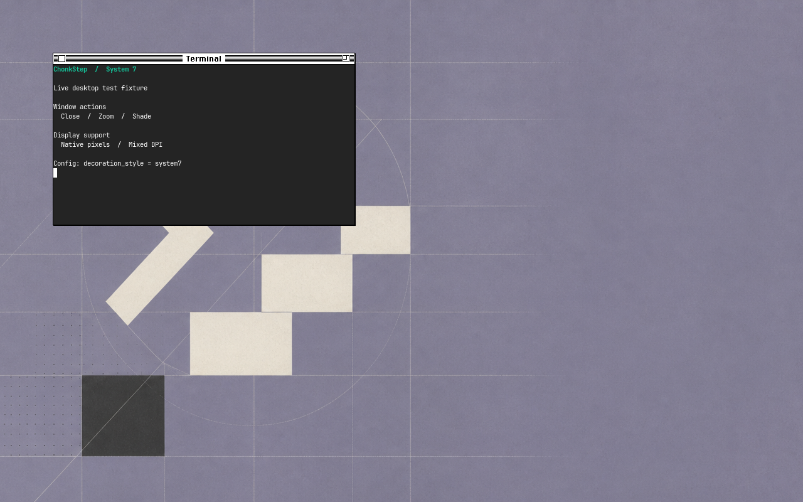
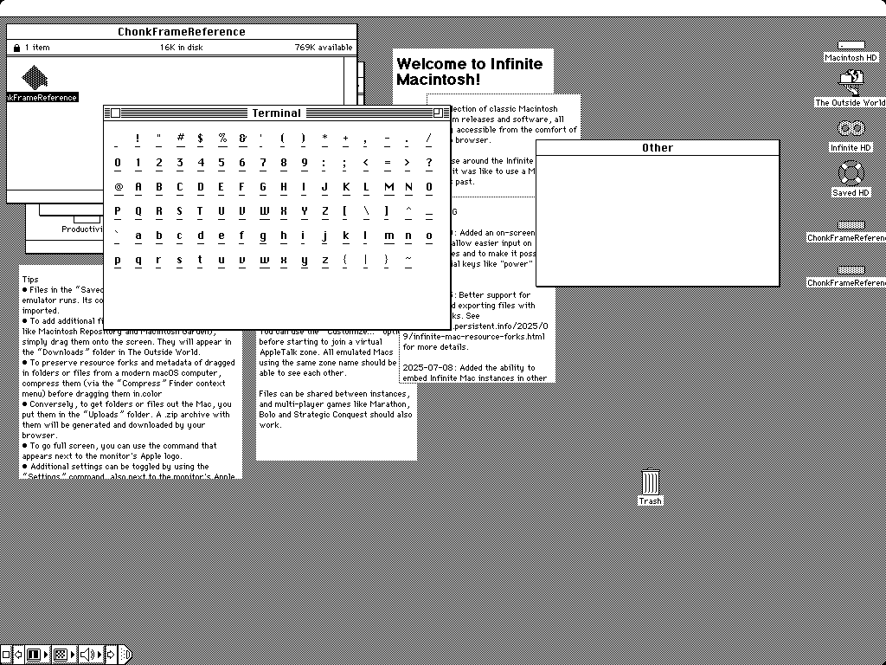
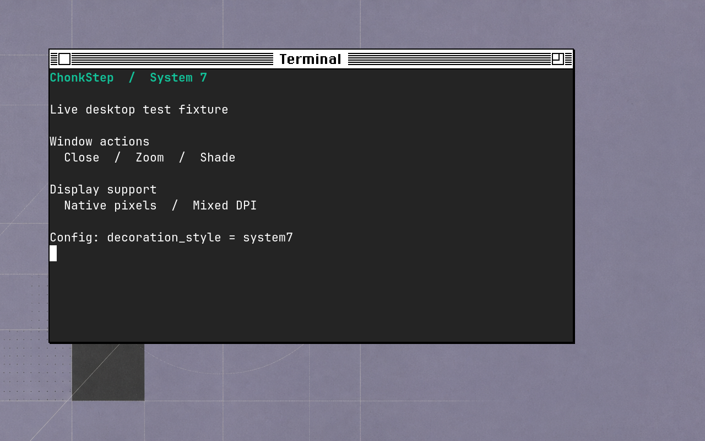

# Decoration styles

The palette and frame recipe are independent:

```toml
theme = "nextstep-classic"         # or another palette, including "omarchy"
appearance = "dark"                # session palette preference
decoration_style = "auto"           # auto | windowmaker | system7 | beos | os2warp | modern
overview_style = "classic"          # classic (default) | cards
```

Edit `~/.config/chonkstep/config.toml` and run `/usr/lib/chonkstep/reload.sh`. The selector is
config-only; there is no competing state file, request file or root-menu picker.
The default `auto` follows the theme: OS/2 Warp 4 selects `os2warp`, BeOS R5 selects BeOS, System 7 themes select System 7, themes
with modern chrome tokens select Modern, and existing palettes select WindowMaker.
System 7 Classic, Light Gray, and Dark Gray are available through the ordinary
[theme picker](system7-themes.md). An explicit recipe overrides
that choice across theme switches. Unknown names and non-string values produce
a warning and retain Auto while the rest of the config applies. `--check-config`
reports the diagnostic and `--print-config` prints the configured policy. The
control socket's `theme` event and the session's look-change log carry the
resolved `decoration_style`, never `auto`.

WindowMaker keeps its existing frame, title and control behavior. System 7 uses
the measured classic document-window recipe: close left, zoom right for resizable
windows, striped active title, a one-pixel outline and offset shadow, and no
miniaturize button. Its chrome is always light. [The reference specification](decoration-styles/system7.md)
describes its measured pixels, original title atlas, palette roles and exact
integer versus faithful fractional scaling. Theme following continues to supply
the active style's palette.

Reloading reflows each managed frame once through the same backend path as a
theme change. Floating clients keep their content geometry, workspace and stack
position. Spatial layouts recompute their available client area for the new
chrome. An active move/resize is rebased to the new frame so the next pointer
motion uses current offsets and opposite edges. Minimized/shaded frames are
updated for their eventual restore; fullscreen and client-decorated windows keep
their normal decoration exemptions.

Mac keyboard behavior is a separate feature: changing decoration style does not
change Command-key translations, shortcuts or Spaces policy.

## Window-derived shell surfaces

Overview defaults to the earlier Mission Control arrangement: a strip of desktops
across the top and large live window previews below. `overview_style = "classic"`
keeps that arrangement with every theme, including Obsidian, Washi, Relay and
Omarchy. `"cards"` opts into numbered workspace cards with modern themes; legacy
themes fall back to Classic. This choice is independent of window decorations,
keyboard translation, Freeform/Mosaic/Flow and per-monitor/fullscreen Spaces.
Changing it during Overview closes the view and releases its input; reopen to
use the new arrangement. In Classic, clicking a desktop keeps Overview open;
clicking a window activates it and closes the view. Escape also closes it.

Root and window commands menus, Alt-Tab, minimized window icons, and Overview
cards/captions follow `decoration_style`. System 7 uses light paper and ink,
the same original Chicago-metric atlas as its frames, flat outlines, offset
shadows and inverted menu selections. These shell designs are original
adaptations; the historical pixel-exact claim applies to the document frames.
Changing style closes an open menu and releases its input grabs; subsequent
menus use the new geometry and hit targets. Minimized icons repaint in place.

Wayland Overview continues to transform live client textures. Only small
captions are rasterized when the scene's text or layout changes. Hover and
animation retain their caption buffers and GPU element identities; opening
Overview does not request window screenshots or an output-sized shell buffer.
Native X11 uses the raster fallback. Both backends preserve the flat panels'
transparent shadow corners; X11 installs and caches a matching Shape region,
then restores the server's default shape when a surface returns to WindowMaker.

The dock, instruments and workspace furniture follow the theme's shell tokens
independently of this frame override. For example, `system7` with Obsidian keeps
Obsidian's modern rail; `modern` with a legacy palette imports its colors for the
frame while preserving that theme's existing dock design. `omarchy-export-themes`
resolves sample frames through `auto`, showing each theme's default recipe
without reading a running session's decoration-style setting. Capture overlays
and other independent tools retain their own existing interfaces.

The public `wm_theme::UiChrome` handle shares the session's resident `FontState`;
construct it at startup or a look change, and retain rendered captions. Existing
standalone menu/icon/switcher/Overview APIs keep their WindowMaker defaults.
The [120-case shell oracle](../crates/wm-theme/tests/fixtures/shell-chrome/README.md)
covers both styles at 1×, 1.5× and 2× in two palettes. Its generator also compares
each WindowMaker result to the original public renderer. Reproduce actual
desktop interactions and captures with `scripts/e2e.sh --headless --test shell_chrome`.
The historical [shell gallery](benchmarks/decoration-styles-2026-09-11/desktop-reference/shell-chrome/README.md) shows each surface in
both styles at 1× and 2×. The [release measurements](benchmarks/decoration-styles-2026-09-11/shell-chrome/README.md)
include the unchanged surrounding workloads and the event-time shell raster costs.

System 7 bounds popup raster dimensions to 8192 physical pixels. A menu that
cannot represent all its rows is rejected without taking input grabs; hidden
rows cannot remain keyboard-activatable. Very large switchers show a bounded
window of entries around the selected client. These limits do not change the
underlying window list or the selected window.

## OS/2 Warp 4

`os2warp` selects the original 1996 PM frame and custom Workplace Shell surfaces.
Choose **OS/2 Warp 4** with `auto` for the original blue textured wallpaper too.
The left title icon opens the window menu; the right controls close, minimize,
and maximize/restore. See the [theme guide](os2-warp-theme.md) and
[capture specification](decoration-styles/os2warp.md).

## BeOS R5

`beos` selects the short-tab frame and the custom Tracker-style shell surfaces.
Choose **BeOS R5** with `auto` to include its fixed blue desktop and application
palette. See the [theme guide](beos-theme.md) and
[capture-based specification](decoration-styles/beos.md) for fidelity, scaling,
font substitution, input behavior and verification.

## Rendering and verification

`RasterThemeEngine::with_style(DecorationStyle)` explicitly selects a renderer and
returns an error for a reserved but unavailable style. Existing constructors keep
their signatures and default to WindowMaker. `SUPPORTED_DECORATION_STYLES` lists
only implemented renderers, so tests and tools never exercise a silent stand-in.
The frame recipes live in `wm-theme/src/styles/windowmaker.rs` and
`wm-theme/src/styles/system7.rs`; font discovery,
glyph/title caches and per-scale variants stay in the shared engine.

Offline inspection preserves the original positional arguments:

```sh
cargo run -p wm-theme --example dump_decoration -- --style windowmaker 2 "Terminal" /tmp/frame
cargo run -p wm-theme --example dump_decoration -- --style system7 2 "Terminal" /tmp/system7
cargo run --release -p wm-theme --example performance -- --style windowmaker
```

The [720-case compatibility oracle](../crates/wm-theme/tests/fixtures/windowmaker/README.md)
pins pre-refactor WindowMaker geometry and every sparse pixel, with a fixed
test-only font. Its explicit generator refuses to overwrite existing fixtures.

System 7 has 84 byte-exact checks against the genuine OS-captured monochrome
matrix at 1× and its nearest-neighbor 2× replication. Another 144 implementation
goldens pin the documented 1.25×/1.5× rounding policy; these fractional examples
are not historical captures. Native Wayland and XWayland tests compare the
rendered frame with a real desktop capture, exercise both boxes, shade/unshade,
shadow and external-ring resizing, repeated live switching, and mixed DPI.
Native X11 wire tests verify the server's Shape regions, stacking, transparent
input delivery and cleanup after switching back.

The invisible resize margin is four logical pixels outside the visible frame.
All eight edge/corner directions work; 28-pixel L-shaped corner grips avoid
stealing client or button input. At 1× a 400×240 client has a 403×261 visible
frame and a 411×269 input frame, with client offset (5,23). Shading gives a
20-pixel visible height and a 28-pixel input height. Layout, snapping, Overview,
workspace previews and window capture use the visible bounds. Input uses the
larger bounds. The margin and the two unpainted shadow corners remain
transparent on both backends, including without an X11 compositing manager.

ASCII and Latin-1 titles use the embedded original atlas. Other scripts use a
resident selection of installed fallback fonts prepared during session startup.
Common Cyrillic, Greek, CJK, Arabic, Hebrew, Indic and other script probes choose
available faces; new title text never opens a font file on the rendering path.
Fallback glyphs are thresholded to the same two palette roles before scaling.
Missing coverage produces a visible box. Installing another font requires a
session restart to update this resident set. Fallback text is compatible, not
pixel-exact Chicago. The offline System 7 API caps scale at 16 and client
dimensions at 8192, matching the compositor's client-dimension safety limit.

## Desktop captures

Unmodified captures of a real Foot client from the `system7` end-to-end test,
using the classic palette. The 2× frame is drawn at native output density.
The reference column is the genuine monochrome System 7.5 emulator capture;
its test oracle at 2× is exact nearest-neighbor replication of the 1× pixels.

| Live ChonkStep | Historical reference |
| --- | --- |
| [](benchmarks/decoration-styles-2026-09-11/desktop-reference/system7-1x.png) | [](decoration-styles/system7/reference/1bit/zoom-short-active.png) |
| [](benchmarks/decoration-styles-2026-09-11/desktop-reference/system7-2x.png) | The same 1× reference replicated exactly at 2×; no additional historical capture is implied. |

Reproduce the client scenes, pixel assertions and captures with
`scripts/e2e.sh --headless --test system7`. The terminal text is fixture content,
not a test-result display; the test runner records the assertions separately.

## Performance contract

Every style inherits the gates in [issue #159](https://github.com/iconidentify/chonkstep/issues/159).
The [September 11 baseline](benchmarks/decoration-styles-2026-09-11/README.md)
records main before the style refactor, including executable hashes and raw samples.

- Render/layout microbenchmarks cover 800×600, 1280×800 and 2560×1600 content
  at scales 1 and 2, with cold and warm title caches, allocation counts/bytes,
  exact retained pixel bytes and output checksums. WindowMaker must remain
  within measured run-to-run noise; a new style must not exceed its equivalent
  WindowMaker workload. Archive every sample and compare the same binary/config.
- `decoration_contract` preserves the pre-style ceilings: four requests/600 bytes
  for layout and eight requests with size-dependent bytes for warm rendering.
  The [current measurements](benchmarks/decoration-styles-2026-09-11/system7/README.md)
  use two layout allocations (360 bytes for WindowMaker, 280 for System 7) and
  six warm-render allocations for either style. The owned-buffer API allocates;
  a style must not raise the ceilings or call these copies allocation-free.
- Sparse parts stay within the frame, never cover client pixels, never overlap,
  and retain at most perimeter × maximum band width × four RGBA bytes, across
  focused/inactive, resizable/fixed, shaded and button states at 1/1.5/2 scales.
- A real renderer through the wm-core fake backend verifies title/focus/button
  changes preserve non-title pixels. Backends omit unchanged band damage/uploads;
  X11 size changes invalidate retained server pixels, and failed uploads retry.
  A palette which actually changes a side-band color must still repaint it.
- The real renderer receives exactly 60 raster calls for 125 synthetic resize
  inputs across 60 frame boundaries. Pure moves reuse chrome. New styles join
  this same test, rather than a separate mock implementation.
- Nested release sessions measure first-scene readiness, three-client readiness,
  loaded idle CPU/RSS and a real 125 Hz titlebar drag. Use alternating before/after
  runs, retain medians/ranges/raw samples, and distinguish software nesting from
  native GPU/KMS measurements.
- Rebuilding an engine with resident `FontState` performs no file/process I/O.
  A disposable Linux test child installs a syscall tripwire, with a negative
  control proving forbidden I/O terminates it. Initial font discovery and warming
  occur before this boundary. Style atlases must be embedded and initialized at
  construction; tests for new fallback glyph paths must exercise those paths too.
- Add each implemented style to the contract tests and the real mixed-DPI
  `chonk-testkit/tests/scale_change.rs` pixel matrix. All tests run in CI; missing
  dependencies or skipped checks are not passing evidence.

The style seam must preserve `wm_theme_api::ThemeEngine`'s contract. Golden
fixtures are generated deliberately from a named source revision with a committed
generator. System 7 reference goldens must come from genuine emulator captures,
with source and pixel coordinates; renderer output cannot serve as its own oracle.

## Readable window navigation

Modern themes (Obsidian, Washi and Relay) use 192-logical-pixel-wide Alt-Tab
cards with a separate selected-window title. Long candidate lists show a moving
subset around the selection so cards stay inside the monitor rather than shrink.

Set `minimized_previews = true` at the top level of the ChonkStep configuration
to retain standalone desktop previews. These are 160 logical pixels square
(240 physical pixels at 150%), use the current theme, and appear on their
window's Space. Click to restore or drag to reposition. This setting is independent
of keyboard mode and does not enable the retired dock or widgets.
