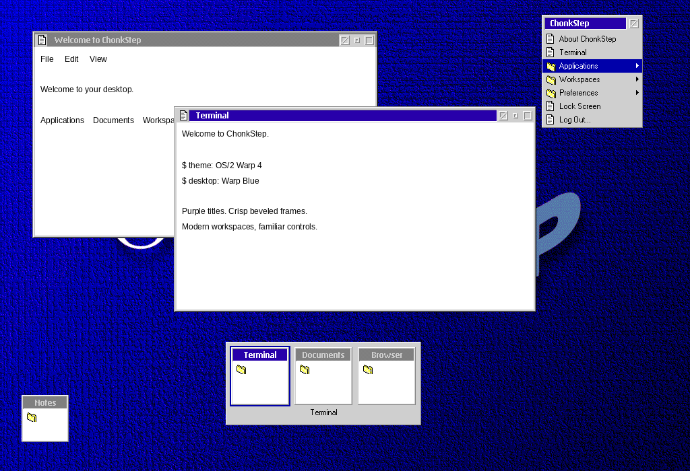
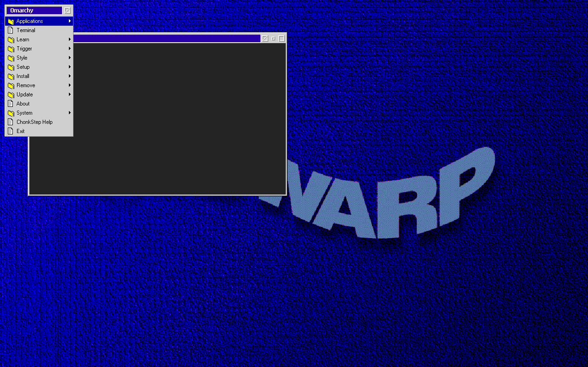
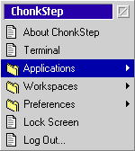
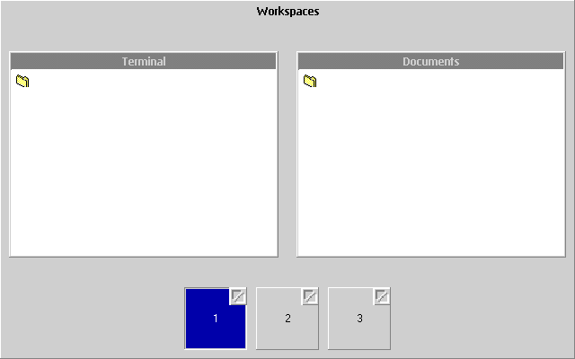
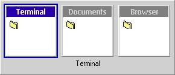
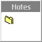

# Reviewed OS/2 Warp 4 output

The renderer examples use the shipping decoration and shell renderers. The
application content is illustrative. Original reference images live separately
in [../reference](../reference/README.md) and are never generated from these
previews.

| Desktop at 1× | Live Wayland compositor at 1× |
| --- | --- |
| [](desktop-1x.png) | [](wayland-menu-1x.png) |

| Posted menu | Overview | Switcher | Minimized tile |
| --- | --- | --- | --- |
|  | [](overview-1x.png) |  |  |

The example also includes 1.25×, 1.5× and 2× versions of every specimen. Integer
scales reproduce the source pixels; fractional scales are new renditions.

`wayland-frame-1x.png`, `wayland-frame-2x.png`, `xwayland-frame-1x.png`, and
`xwayland-frame-2x.png` are unmodified screencopy captures from the isolated
acceptance test. `wayland-window-menu-1x.png` shows the working title-icon menu.
`wayland-minimized-1x.png` shows the minimized preview in the live compositor.

Reproduce into a new output directory:

```sh
cargo run --locked -p wm-theme --example os2warp_preview -- /tmp/os2warp-review
scripts/e2e.sh --headless --test os2warp
```

Capture comparisons cover the historical frames, titles, menu font and folder
icon. Overview, switcher, live previews, the neutral title document icon and
posted-menu header are ChonkStep adaptations, as detailed in the
[specification](../../os2warp.md).
